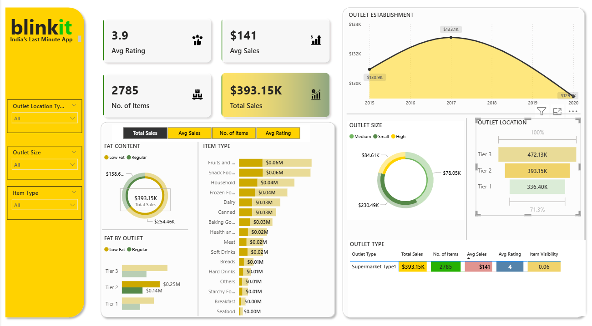

# Blinkit Grocery Sales Analysis

## Project Overview
This project analyzes Blinkit grocery sales data to uncover insights into sales performance, customer preferences, and outlet trends.  
It involves data cleaning, SQL-based exploration, and an interactive Power BI dashboard for visualization.

---

## Project Structure
- **BlinkIT Grocery Data.xlsx** → Raw dataset containing grocery sales details.  
- **SQLQuery1.sql** → SQL queries for data exploration and analysis.  
- **BLINKIT.pbix** → Power BI dashboard file with interactive visualizations.  

---

## Objectives
- Identify sales trends across different product types and outlet categories.  
- Analyze the impact of outlet size, location, and type on sales performance.  
- Study relationships between item visibility, weight, rating, and sales.  
- Build an interactive dashboard for quick decision-making.  

---

## Tools & Technologies
- **Excel** – Data cleaning and preprocessing.  
- **SQL** – Data exploration and aggregation.  
- **Power BI** – Interactive dashboard creation.  

---

## Key Insights
- Outlet Type & Location significantly affect sales performance.  
- Certain product categories like Fruits & Vegetables, Dairy, and Frozen Foods perform better.  
- Higher item visibility does not always guarantee higher sales.  
- Tier 1 locations generally show higher average sales.  

---

## Dashboard Features
- Sales trends by item type, outlet size, and location.  
- Top-selling items and underperforming products.  
- Correlation between ratings and sales.  
- Filtering and drill-down features for detailed exploration.  

---

## How to Use
1. Open **BlinkIT Grocery Data.xlsx** to explore raw data.  
2. Run **SQLQuery1.sql** in your SQL environment to execute analysis queries.  
3. Open **BLINKIT.pbix** in Power BI Desktop to explore the dashboard.  

---

## Sample Dashboard Preview

---

## Contact
For queries or collaborations: [varadgavhad9028@gmail.com]

